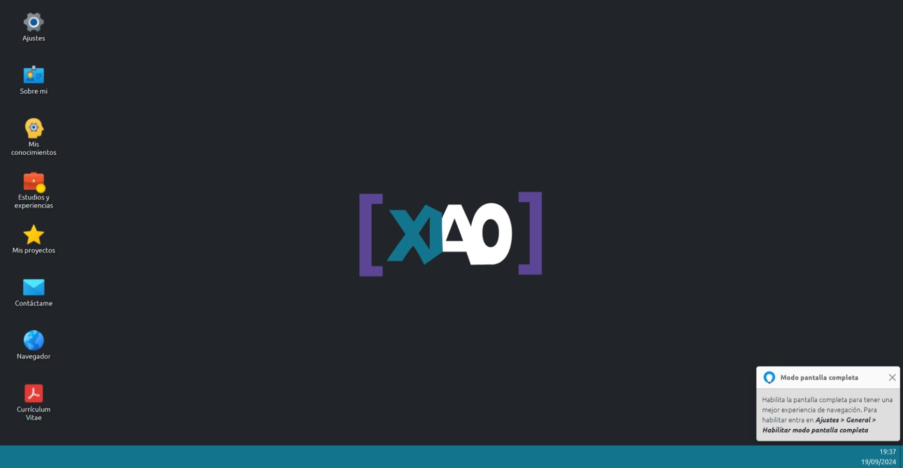
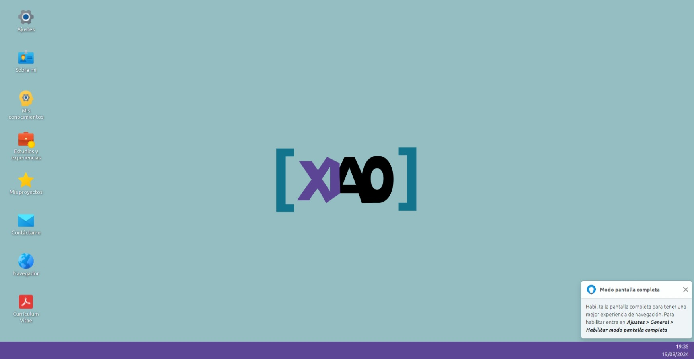
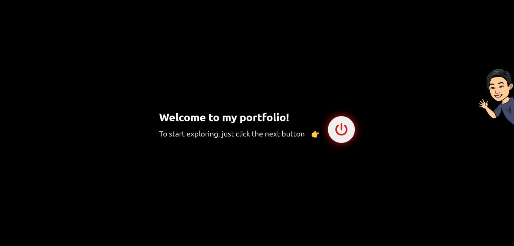
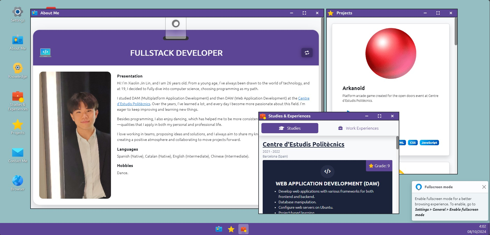

# 🖥️ XiaoDev Portfolio

Hello there! 👋 Welcome to my portfolio.

I'm Xiaolin Jin Lin, a fullstack developer passionate about creating interactive and dynamic web applications. In this portfolio, you will find a showcase of my skills and projects, all designed to provide an engaging user experience that simulates an operating system. Thank you for visiting!

🔗 **Live Project**: [xiaojl.dev](https://xiaojl.dev)

## 📸 Preview

Here are some screenshots of the portfolio:

| Theme 1                                        | Theme 2                                        |
| ---------------------------------------------- | ---------------------------------------------- |
|  |  |




## 📄 Project Information

- **Name**: XiaoDev Portfolio
- **Author**: Xiaolin Jin Lin
- **Email**: [dev@xiaojl.dev](mailto:dev@xiaojl.dev)

## 🌟 Key Features

- **Interactive windows**: Users can open, resize, move, and close windows, providing a desktop-like experience.
- **Responsive design**: The portfolio is designed to work seamlessly on various devices and screen sizes.
- **Smooth animations**: Utilizes animations for a more engaging user experience.
- **Showcase projects**: Highlights various projects and skills, demonstrating my abilities as a developer.

## ⚙️ Stack

The portfolio is built with the following stack:

<div style="display: flex; justify-content: center; align-items: center;">
  
  
  
  
</div>
<br/>

- **Vue 2**: Frontend framework.
- **SASS**: For styling and animations.
- **Bootstrap**: For styles and UI components.
- **PHP**: Handles server-side logic for processing email submissions through the `email.php` file in the `api/` folder.

## 🗂️ Project Structure

- `api/`: Contains the backend logic for handling API requests.
- `dist/`: Folder generated after the build, ready for production deployment.
- `screenshots/`: Contains screenshots showcasing the user interface and functionalities of the portfolio.
- `public/`: Static files and the `index.html`.
- `src/`: Contains the main components, views, and project files.

## 📜 Scripts

The project has the following scripts defined in the `package.json`:

- `npm run serve`: Starts the development server.
- `npm run build`: Builds the app for production.
- `npm run lint`: Runs the linter to detect and fix code issues.
- `npm run format`: Formats the code using Prettier.

## 📋 Environment Variables

This project uses environment variables to manage configuration settings. You can find the following variables in the `.env.example` file:

```bash
VUE_APP_PORT=3000
VUE_APP_API_ENDPOINT_URL=http://localhost:8000
VUE_APP_CV_URL=
VUE_APP_GA_ID=
VUE_APP_RECAPTCHA_V3_SITE_KEY=
```

- `VUE_APP_PORT`: Set the port of development server (default: 3000).
- `VUE_APP_API_ENDPOINT_URL`: The API endpoint URL for making requests (default: `http://localhost:8000/api/`).
- `VUE_APP_CV_URL`: The URL of CV.
- `VUE_APP_GA_ID`: The Google Analytics ID (not required).
- `VUE_APP_RECAPTCHA_V3_SITE_KEY`: The reCAPTCHA v3 site key (required if using the contact form).

Make sure to copy the .env.example file to .env and replace the values with your actual settings before running the project.

## 🐘 Running the PHP Server for sending emails

To start the PHP server for sending emails, ensure that PHP is installed on your machine and that the required environment variables are properly set. First, navigate to the `/api/` directory and install the necessary dependencies by running:

```bash
composer install
```

Before running the PHP server, ensure create a `.env` file from the `.env.example` file and set the required environment variables:

```bash
APP_NAME='XiaoDev Portfolio'
APP_ENV=local

CONTACT_MAIL_FROM=
CONTACT_MAIL_PASSWORD=
CONTACT_MAIL_AUTH=
CONTACT_MAIL_HOST=
CONTACT_MAIL_PORT=
CONTACT_MAIL_SECURE=
CONTACT_MAIL_TO=

RECAPTCHA_URL_VERIFY=https://www.google.com/recaptcha/api/siteverify # The URL for verifying reCAPTCHA v3 responses
RECAPTCHA_V3_SECRET_KEY= # The secret key for reCAPTCHA v3 validation

ACCESS_CONTROL_ALLOW_ORIGIN=http://localhost:3000 # Specifies which origins are allowed to access the API (CORS)
```

- `APP_NAME`: The name of the application.
- `APP_ENV`: The environment of the application (local/production).
- `CONTACT_MAIL_FROM`: The email address from which the contact form submissions are sent.
- `CONTACT_MAIL_PASSWORD`: The password for the email address from which the contact form submissions are sent.
- `CONTACT_MAIL_AUTH`: The authentication method for the email server (true/false).
- `CONTACT_MAIL_HOST`: The host of the email server (e.g., smtp.gmail.com).
- `CONTACT_MAIL_PORT`: The port of the email server (e.g., 587).
- `CONTACT_MAIL_SECURE`: The security method for the email server (tls/ssl).
- `CONTACT_MAIL_TO`: The email address to which the contact form submissions are sent.
- `RECAPTCHA_V3_SECRET_KEY`: The secret key for reCAPTCHA v3 validation.
- `ACCESS_CONTROL_ALLOW_ORIGIN`: Specifies which origins are allowed to access the API (CORS).

Once the environment variables are set, you can start the PHP server by running:

```bash
php -S localhost:8000
```

## 🛠️ Build and Deployment

For building the project, run the following command:

```bash
npm run build
```

The generated files will be in the `dist` folder, ready to be deployed to any web server.

## ☁️ Uploading to a Web Server

To deploy the project to a web server, simply upload the contents of the `dist` and `api` folders to the server. Ensure that the server supports PHP and that the necessary environment variables are properly set.

> ⚠️ **Warning**: For `api` folder, only the following files are required:
> - `vendor/` (The folder containing the dependencies installed via Composer)
> - `logs/` (The folder for storing log files, if applicable)
> - `email.php` (The PHP script responsible for handling email submissions)
> - `.env.production` (Rename this file to `.env` on the server)
>
> There is no need to upload any other files from the project.

## 🚀 Future Improvements

I am committed to continuously enhancing this portfolio project by adding more features and functionalities, as well as improving the code quality. Stay tuned for updates as I strive to improve the user experience and showcase my skills as a fullstack developer!

## 🤝 Get In Touch

I invite you to explore the project and share your thoughts! If you have any questions or feedback, don't hesitate to reach out. Your input is greatly appreciated!
